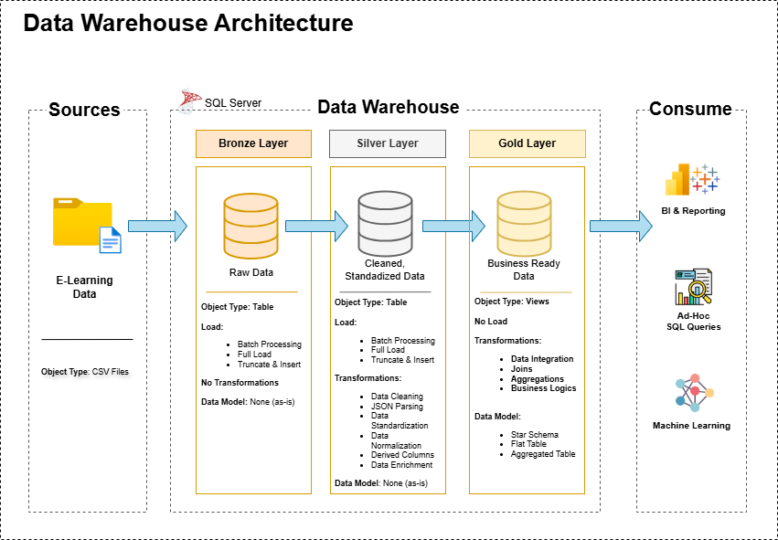

# 🎓 Learning Platform Data Warehouse

A modern data warehouse built using the **Medallion Architecture** (Bronze, Silver, Gold) to model and transform structured data from a learning platform into insightful analytics. This project leverages **Microsoft SQL Server** and SQL transformations to simulate real-world data engineering pipelines, handling user activity logs, course structures, and feedback data.

---

## 🗂️ Data Architecture

This project follows the **Medallion Architecture**, broken into three layers:


### 🔸 Bronze Layer
- **Raw ingestion layer**  
- CSV files from the source system are loaded as-is into SQL Server.
- JSON fields are stored in raw format in this layer.

### ⚪ Silver Layer
- **Cleaned and structured data layer**  
- JSON fields are parsed, and referential integrity is enforced.
- Data is joined, filtered, and transformed to create analytical-ready datasets.

### 🟡 Gold Layer
- **Business logic and insights layer**  
- Contains aggregated views and materialized reports such as:
  - Day-wise lesson completion per user
  - User streak metrics
  - Course completion rates
  - Structured feedback insights

---

## 📌 Project Overview

This project simulates a real-world data pipeline for an EdTech platform with the following entities:

- Tracks → Courses → Topics → Lessons  
- User registration and user info (with nested JSON)
- Lesson progress logs (granular activity logs with timestamps)
- Feedback data with multiple question-response entries

Key outcomes:
- Build a scalable star schema
- Parse and transform nested JSON
- Create useful business views from raw logs
- Follow data engineering best practices using modern naming conventions

---

## ✅ Project Requirements

- Microsoft SQL Server (any edition)
- SQL Server Management Studio (SSMS)
- CSV files (provided in `bronze` layer)
- Optional: Power BI or Tableau for dashboarding

---

## 📁 Repository Structure
```
EDlearning-platform-data-warehouse/
│
├── docs/                               # Project documentation and architecture details
│   ├── etl.drawio                      # Draw.io file shows all different techniquies and methods of ETL
│   ├── data_architecture.drawio        # Draw.io file shows the project's architecture
│   ├── data_catalog.md                 # Catalog of datasets, including field descriptions and metadata
│   ├── data_flow.drawio                # Draw.io file for the data flow diagram
│   ├── data_models.drawio              # Draw.io file for data models (star schema)
│   ├── naming-conventions.md           # Consistent naming guidelines for tables, columns, and files
│
├── scripts/                            # SQL scripts for ETL and transformations
│   ├── bronze/                         # Scripts for extracting and loading raw data
│   ├── silver/                         # Scripts for cleaning and transforming data
│   ├── gold/                           # Scripts for creating analytical models
│
├── tests/                              # Test scripts and quality files
│
├── README.md                           # Project overview and instructions
├── LICENSE                             # License information for the repository
├── .gitignore                          # Files and directories to be ignored by Git
└── requirements.txt                    # Dependencies and requirements for the project
```
---

📖 License

This project is open-sourced under the MIT License.
